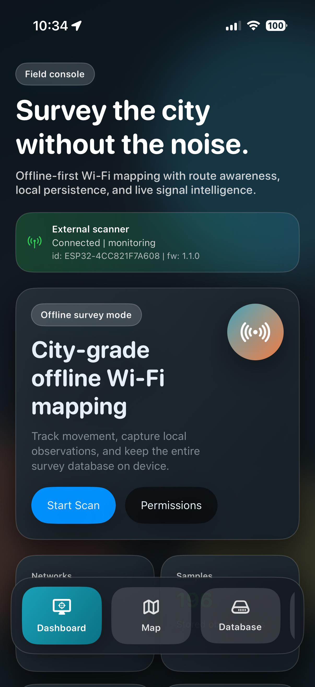
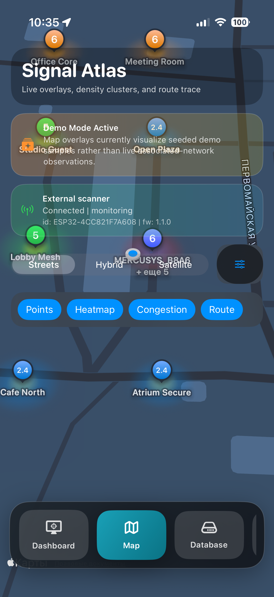
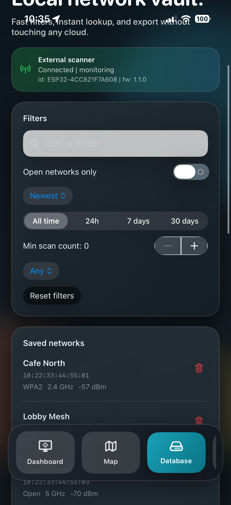
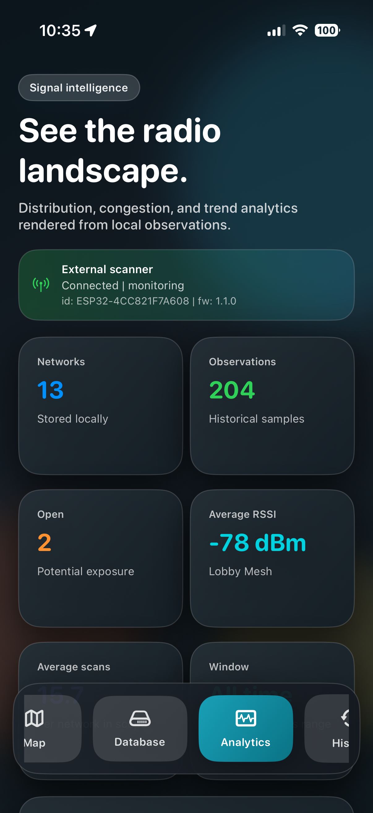
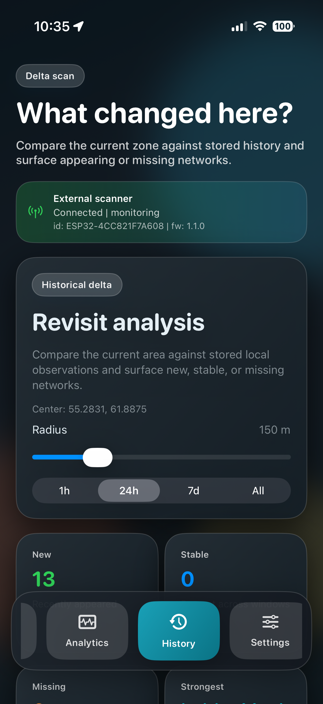
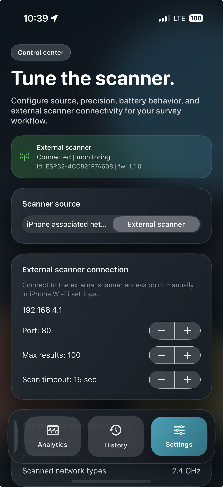

# IOS-Mapper WiFi

IOS-Mapper WiFi is an iPhone application for Wi-Fi survey workflows with offline storage, map visualization, analytics, and optional integration with an ESP32 external scanner.

This project is designed to be free to use for research, education, testing, and production-like field diagnostics.

## Related Project

This mobile app depends on the companion firmware project:
- [ESP32-Mapper WiFi](https://github.com/Developer-RU/ESP32-Mapper-WiFi)

## What This App Does

- Collects Wi-Fi observations and geolocation context.
- Stores data locally in Core Data (offline-first workflow).
- Displays current and historical data on map overlays.
- Compares historical area snapshots.
- Shows signal/security/channel analytics.
- Imports scan data from an external ESP32 scanner via HTTP API.

## Scan Sources

The app supports two scan modes:

1. `iPhone associated network`
- Uses public iOS APIs.
- Can read only the currently associated network.

2. `External scanner`
- Uses ESP32 scanner HTTP endpoints.
- Supports full nearby network scan ingestion.

## External Scanner Integration

When `External scanner` is selected, IOS-Mapper WiFi:

1. Checks scanner availability (`GET /status`).
2. Pushes scan configuration (`POST /configure`).
3. Starts and stops scan sessions (`POST /scan/start`, `POST /scan/stop`).
4. Polls result payloads (`GET /scan/results`).
5. Saves observations to local history and analytics datasets.

Important: Wi-Fi AP connection is manual in iOS system settings. The app does not auto-join scanner access points.

## Project Structure

- `Sources/App` - app composition, localization helpers, app model.
- `Sources/Models` - domain and settings models.
- `Sources/Persistence` - Core Data stack and repository layer.
- `Sources/Services` - scanner, location, export, background services.
- `Sources/ViewModels` - presentation logic.
- `Sources/Views` - SwiftUI screens and components.
- `Resources` - Info.plist, entitlements, localized strings.
- `Tests` - unit tests for data and repository behavior.

Additional docs:
- [Architecture](docs/ARCHITECTURE.md)
- [External Scanner Guide](docs/EXTERNAL_SCANNER.md)
- [Release Notes v1.0.0](docs/RELEASE_NOTES_v1.0.0.md)

## Build and Run

### Requirements

- Xcode 26+
- XcodeGen
- iOS device (recommended for real field testing)

### Steps

1. Generate the project:
   - `xcodegen generate`
2. Open:
   - `WiFiMapper.xcodeproj`
3. Configure signing team in Xcode.
4. Build and run on device.

## Permissions and Capabilities

- Location (`When In Use` + `Always`)
- Local Network access
- Access WiFi Information entitlement
- Background location and processing modes
- ATS local-network allowance for scanner HTTP endpoints

## Data Handling and Privacy

- Data is stored locally by default.
- No mandatory cloud dependency.
- Export is explicit and user-triggered.

## Screenshots

   
   
   

   
   
   

## Free Use Notice

This project is intended to be freely usable. If you distribute or publish it, include a license file and attribution policy appropriate for your organization.
